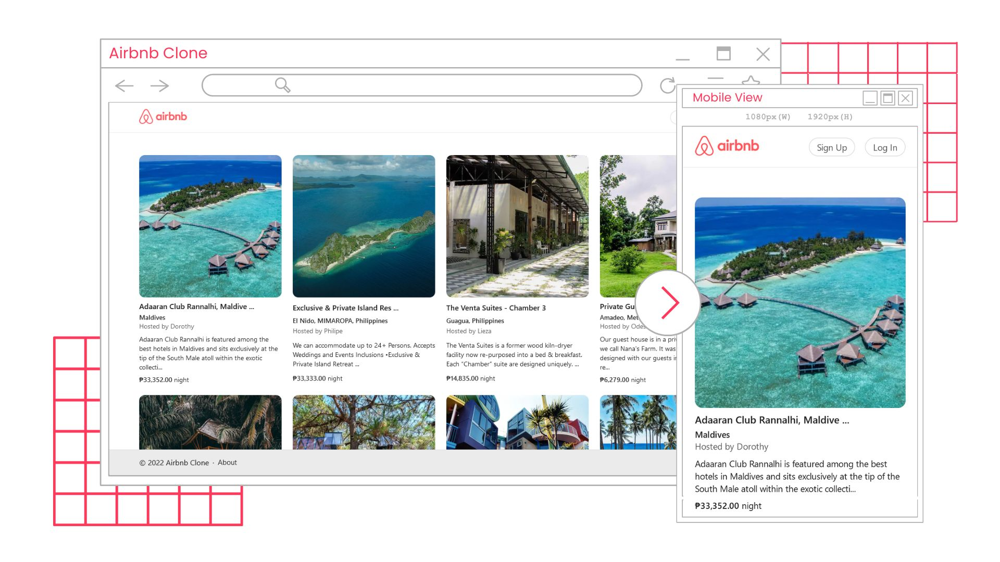
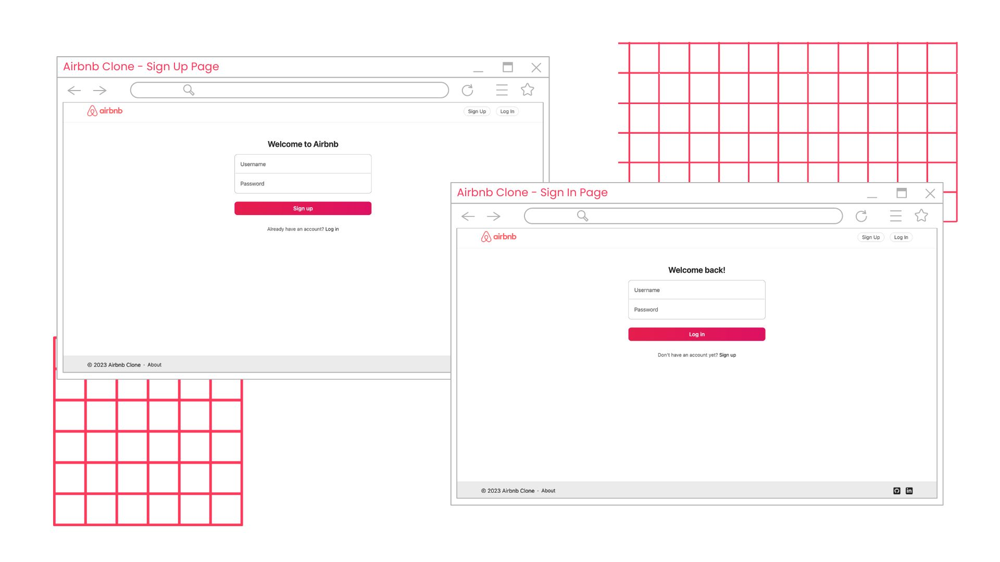
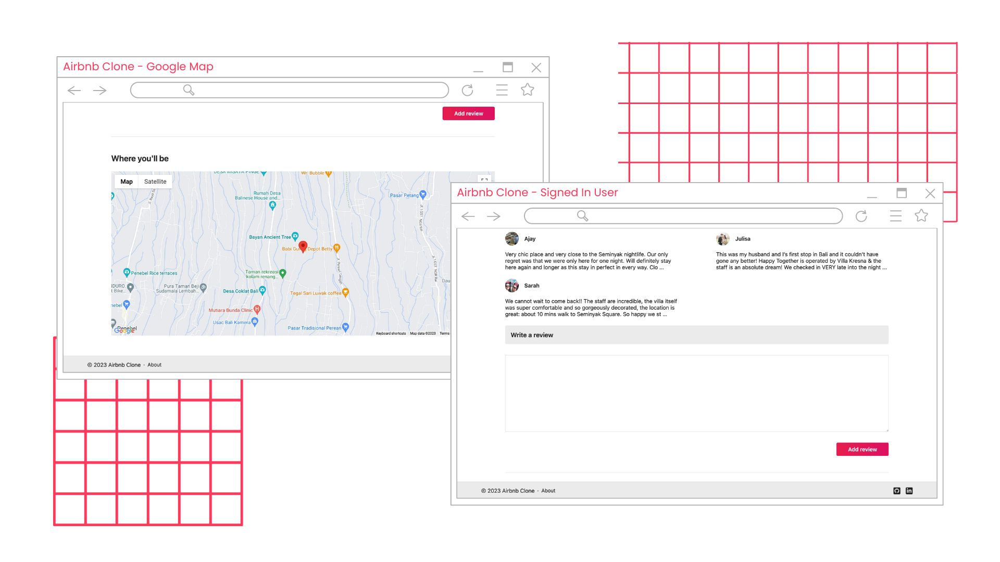

# Airbnb Clone

   

Airbnb Clone is the final output for Bayan Academy's Backend Web Development.

## Table of Contents

- [Airbnb Clone](#airbnb-clone)
  - [Table of Contents](#table-of-contents)
  - [Overview](#overview)
    - [The requirements](#the-requirements)
      - [Landing Page](#landing-page)
      - [Sign-In Page](#sign-in-page)
      - [Sign-Up Page](#sign-up-page)
      - [Individual Listing Page](#individual-listing-page)
    - [Screenshots](#screenshots)
  - [Set-up](#set-up)
  - [My process](#my-process)
    - [Built with](#built-with)
    - [Continued development](#continued-development)
  - [Author](#author)

## Overview

### The requirements

#### Landing Page

The landing page should list down all the active listing of the website. In this page, there should be an option for sign-in and sign-up.

- The user should be able to see all the listings regardless if loggSed in or not.
  Each list must have the following details:
  - Name of Listing
  - Username of the Uploader
  - Short Description
  - Address
- A sign-in button must be present.
- A sign-up button must be present.
- The user can click listing and view its full details. If signed-in, the user
  should be able to add a review to the list. If not, no option should be given
  to the user.
- If signed in, a sign out button must be present.

#### Sign-In Page

- The user should be able to sign-in and go back to the page once signed-in.
- Sign-out option must be present if the user is signed-in.

#### Sign-Up Page

- The user should be able to register his/her username and password.
- Should be able to sign-in once registered.

#### Individual Listing Page

- Individual Listing must have the following details:
  - Name of Listing
  - Username of the Uploader
  - Detailed Description
  - Address
  - Date posted
  - Map (Use Map API)
  - Reviews
- Option to add a review if the user is signed-in.

### Screenshots





## Set-up

1. Clone this repo.
   ```
   clone https://github.com/erelropeta/airbnb-clone.git
   ```
2. Generate an API key from the [Google Cloud Platform](https://cloud.google.com/free) and place your API key in an `.env` file.
   ```
   API_KEY = /* place your API key here */
   ```
3. Install dependencies.

   ```
   npm i
   ```

4. Create your MongoDB database locally by running `seeds.js`.

   ```
   node seeds.js
   ```

5. Run `index.js` and visit [http://localhost:3000/](http://localhost:3000/) on your browser.

   ```
   node index.js
   ```

## My process

### Built with

- HTML
- CSS
- BEM
- [Node.js](https://nodejs.org/en)
- [Express.js](https://expressjs.com/)
- [EJS](https://ejs.co/)
- [MongoDB](https://www.mongodb.com/)
- [Maps Javascript API](https://developers.google.com/maps/documentation/javascript/overview)
- [Geocoding API](https://developers.google.com/maps/documentation/geocoding/overview)

### Continued development

I'm planning to deploy this soon with additional features such as:

- Improve and updated UI
- Database using MongoDB Atlas
- Authentication using [Auth0](https://auth0.com/) or [Passport](https://www.passportjs.org/)
- Create a filtering feauture for the displayed active listing

## Author

- LinkedIn - [/erelropeta](https://www.linkedin.com/in/erelropetas)
- Github - [/erelropeta](https://github.com/erelropeta)
- Frontend Mentor - [@ereljapco](https://www.frontendmentor.io/profile/ereljapco)
